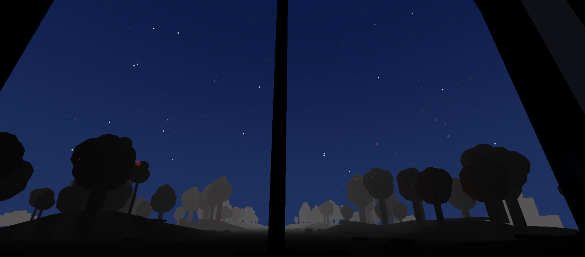

# Chihiro Train

_Sea Plain Railway — inspired by Hayao Miyazaki's Spirited Away_

A WebXR train journey through procedurally generated landscapes. You ride an endless railway that crosses oceans in storms, passes through dense jungles, dives into crystal-lit caves, and emerges into neon cities at night. Built with Three.js and TypeScript. Works on desktop and VR headsets.

The name comes from the train Chihiro rides in _Spirited Away_ (千と千尋の神隠し) — the one that runs on tracks submerged in water, carrying passengers across a flooded plain toward the horizon. This project tries to capture that same feeling: sitting in a quiet cabin, watching the world drift by through rain-streaked windows.



## The journey

The train follows a 16-biome loop that always starts the same way — on water, in a storm:

**ocean** → village → spring meadow → autumn forest → **amazon** → **cave** → tunnel → industrial → dark city → suburban → construction → wilderness → thunderstorm → frozen waste → polar → arctic coast → _back to ocean_

Each biome lasts one full day/night cycle (8 minutes). Transitions between biomes take 15 seconds — every parameter crossfades smoothly. After arctic coast, the loop restarts from the ocean crossing.

## How terrain works

The world is an infinite treadmill. Eight terrain chunks (40m × 80m each) cycle in a pool. As the train moves, the rearmost chunk jumps to the front with fresh terrain.

Height is generated with **2D Simplex noise** layered through **Fractal Brownian Motion** (FBM):

```
height = fbm(simplex2D, x * 0.02, z * 0.02, octaves=3, lacunarity=2.0, persistence=0.5)
```

Three octaves stack together — each doubles the frequency and halves the amplitude — producing terrain with both broad hills and fine detail. A sine clearance profile keeps the track area flat. The noise is seeded (42), so generation is deterministic.

Ground color blends two biome-defined tones using a separate noise sample, giving a patchy organic look.

## Procedural noise

Noise functions drive most of the visual variety in the project. Three distinct implementations serve different systems:

- **Simplex 2D** (`utils/noise.ts`) — seeded permutation table, gradient-based. Used for terrain height (3-octave FBM) and ground color variation. Runs on the CPU once per chunk rebuild — deterministic across sessions.
- **Value noise** (GPU shaders) — `hash(vec2) → fract(sin(dot(...)))` with bilinear interpolation. Used in cloud generation (2-octave FBM, 8 hash calls/fragment) and water surface foam/shimmer. Runs per fragment every frame but stays cheap because the hash is a single `sin+fract`.
- **Brown noise** (Web Audio) — cumulative random walk filtered through lowpass. Drives the train rumble and rain ambience. Three filtered layers stack for depth.

Biome transitions use **smoothstep-interpolated lerp** — not noise — to crossfade every numeric parameter (fog, sky color, lighting, cloud coverage, terrain amplitude) over 15 seconds. Booleans and discrete values snap at the midpoint. Weather type snaps at 95% to avoid flickering.

## Biomes

Each biome defines fog, sky, lighting, ground colors, flora rules, weather, and terrain amplitude. Some highlights:

- **Ocean** — flat seabed with coral, seaweed, sunken ruins visible through transparent water. Storm weather, lightning, heavy rain.
- **Amazon** — towering jungle trees (up to 10× scale), hanging vines, giant leaves, ferns, overgrown stone ruins. Heavy storm with lightning.
- **Cave** — brown tunnel with stalactites hanging from above, stalagmites rising from the floor, glowing crystals, bioluminescent mushrooms, puddles on the ground.
- **Polar** — frozen pines, ice pillars, aurora borealis at night.
- **Dark city** — neon signs, skyscrapers, street lamps in fog.

## Flora

All objects are built from geometric primitives — cylinders, cones, spheres, icosahedrons, boxes. No external 3D models. Each biome specifies spawn rules: which models, how many, at what scale, in which distance band from the track. Everything renders with instanced meshes.

Over 120 model types: pine trees with snow caps, autumn oaks, coral branches, stalactites, jungle vines, city buildings, lighthouses, sunken ships, igloos, cranes, mushrooms.

## Weather

12 weather types with particle systems: snow, rain, blizzard, storm, drizzle, frost, leaves, ash, petals, hail, smog, sandstorm. Storm mode runs 18,000 particles. Weather crossfades between biomes.

Lightning uses multi-phase flash sequences — initial flash, brief dark, main flash, sustain, slow decay — with occasional re-flashes. Not a simple on/off blink.

## Clouds

A procedural cloud layer sits on a hemisphere dome (r=260) between the sky dome and celestial bodies. The shader uses 2-octave FBM value noise — 8 hash calls per fragment, one draw call total. Each biome defines a `cloudCoverage` value (0 = clear, 1 = overcast). Thunderstorm and amazon biomes run heavy coverage (0.85–0.9), ocean and construction stay light (0.15–0.25), caves and tunnels have none. Clouds shift color with the day/night cycle — white in daylight, orange at sunset, dark grey at night. Wind scrolls the noise field. Coverage crossfades smoothly between biomes.

## Day/night cycle

Full cycle: 8 minutes. Dawn transitions and sunset use smoothstep easing for gradual shifts. The sun arc uses power-eased sine so it lingers at the top and sets slowly. Stars fade with the transitions. Polar biomes show aurora borealis at night.

## The cabin

3m × 3m × 6m interior. Front: driving console with levers, gauges, buttons. Back: bed, nightstand with lantern, small kitchen. Windows get frost in cold biomes and rain streaks in storms.

Behind the cabin is a Spirited Away-style wooden passenger car with barrel-vault ceiling, red velvet bench seats, brass poles, and warm amber lighting. **No-Face (Kaonashi)** sits quietly on one of the benches — built with LatheGeometry for a smooth bell-shaped profile, a translucent ghost overlay, a white mask with painted eyes and mouth, and a dark puddle spreading beneath him.

All audio is procedural — no samples. Train rumble is brown noise through a lowpass. Wheel hum is bandpass-filtered noise. Rail clack is a periodic burst. Rain is three filtered noise layers plus drip sounds.

## Running it

```bash
npm install
npm run dev
```

Opens at `https://localhost:5173`. HTTPS is needed for WebXR.

## Stack

- **Three.js** — rendering, shaders, scene graph
- **TypeScript** — all source
- **Vite** — dev server and bundler
- **Web Audio API** — procedural sound
- **WebXR** — VR headset support

## Acknowledgment

This project is a love letter to Studio Ghibli and Hayao Miyazaki's work. The ocean train sequence in _Spirited Away_ is one of the most beautiful moments in animation — quiet, melancholic, and vast. We wanted to sit in that train and never get off.
